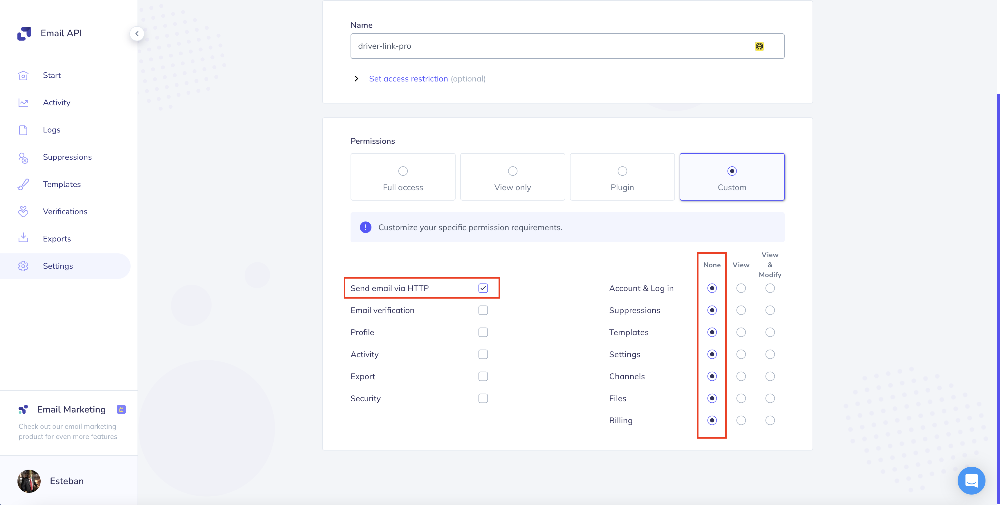
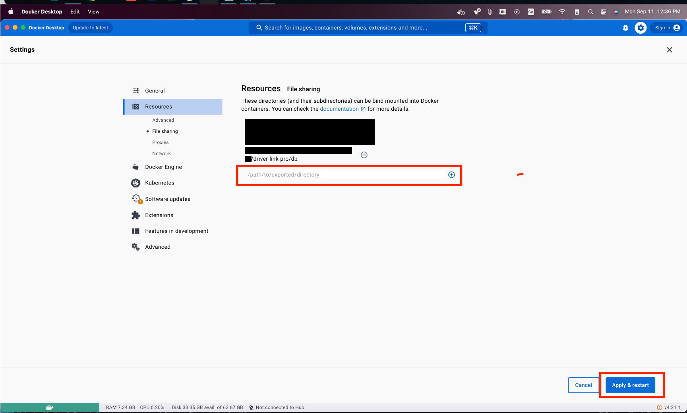

<br />

<h2 align="center"><b>DriverLink PRO</b></h2>
<h3 align="center"><b>DriverLink PRO REST API 1.0</b></h3>

<br />

<p align="center">
  <a href="https://spring.io/" target="blank"></a>
</p>

<p align="center">
    <a href="https://escalab.tech/" target="_blank">Escalab Tech</a>
</p>

## 📢 **Overview**

- **Project**: DriverLink PRO REST API 1.0
- **Application**: DriverLink PRO REST API 1.0
- **Type**: REST API
- **Tech Stack**: Spring Boot, Docker
- **Tech Lead**: Garviso, Esteban <e.garvisovenegas@gmail.com>
- **Architect**: Garviso, Esteban <e.garvisovenegas@gmail.com>
- **Scrum Master**: Garviso, Esteban <e.garvisovenegas@gmail.com>
- **Quality Assurance**: Garviso, Esteban <e.garvisovenegas@gmail.com>
- **Tech Manager**: Garviso, Esteban <e.garvisovenegas@gmail.com>
- **Database**: [Yes] PostgreSQL
- **Analytics**: [No]
- **Development environment**:
    - URL: https://

## ✒ **Description**

REST API for DriverLink PRO project to get Spring Boot Rest API Certification on Escalab Tech.

## ⛩ **Structure**

Hexagonal architecture.

More info:
[Command Query Responsibility Segregation Wiki](https://en.wikipedia.org/wiki/Command%E2%80%93query_separation),
[Rules to better clean architecture](https://www.ssw.com.au/rules/rules-to-better-clean-architecture/),
[Hexagonal Architecture Wiki](<https://en.wikipedia.org/wiki/Hexagonal_architecture_(software)>),
[Dependency Injection Wiki](https://en.wikipedia.org/wiki/Dependency_injection),
[Conventional Branches](https://codingsight.com/git-branching-naming-convention-best-practices/),

```bash
# Scaffolding
├── src/
│    ├── main/
│    │    ├── java/
│    │    │    └── com.estebangarviso.driverlinkpro/
│    │    │        ├── application/
│    │    │        │    ├── config/
│    │    │        │    └── usecase/
│    │    │        ├── domain/
│    │    │        │    ├── model/
│    │    │        │    ├── exception/
│    │    │        │    └── service/
│    │    │        └── infrastructure/
│    │    │             ├── adapter/
│    │    │             ├── api/
│    │    │             └── auth/
│    │    └── resources/
│    │         └── application.properties
│    └── test/
│
└── pom.xml
```

## 📥 **Let's begin**

- Create an account in [Elastic Email](https://app.elasticemail.com/), and follow these instructions to configure the SMTP server: [Elastic Email SMTP Configuration](https://elasticemail.com/developers/api-libraries/java/). At one point you would need to config permissions of the API like this:
  
     and get your API key.
- Rename `secrets.properties.example` to `secrets.properties` in `resources` directory and fill the properties with your credentials.
- Exec `mvnw clean install` to install dependencies.
- Modify `application.properties` file with your database credentials and custom configuration.
- Exec `docker-compose up -d` to run database.
- Exec `mvnw spring-boot:run` to run the project in development mode OR
  - Exec `mvnw package` to build the project as a jar and run it with `java -jar target/driver-link-pro-<VERSION>.jar` command to run the project in production mode.
- Open `http://localhost:8080/swagger-ui/index.html` to see the Swagger UI and `http://localhost:8080/v3/api-docs` to see the OpenAPI specification.

## 📋 **Branches and Execution and Deployment Environments**

There are 2 environments (infrastructure) to run/compile the project.

- **dev (development)**: new requirements and breaking changes.
- **prod (production)**: production environment.

## 🧪 **Execution**

The project uses **mvnw scripts** for development.

| Command                      | Action                                                  |
|------------------------------| ------------------------------------------------------- |
| mvnw spring-boot:run         | Run the project in development mode                     |
| mvnw spring-boot:test-run    | Run the tests                                           |
| mvnw spring-boot:build-image | Build the project as a docker image                     |
| mvnw clean install           | Clean and install dependencies                          |
| mvnw package                 | Clean and package the project as a jar                  |

For its correct use, it is recommended to program in [IntelliJ IDEA](https://www.jetbrains.com/idea/).

## 🛠️ **FAQ**

- **Docker Desktop 500 Error**

  Remember to allow Docker Desktop to access your local files for the project `Docker Desktop > Settings > Resources > File Sharing` and add volumes for the project.

- **FATAL: role "postgres" does not exist**

  Make sure the port 55432 is not being used by another process and try again.

